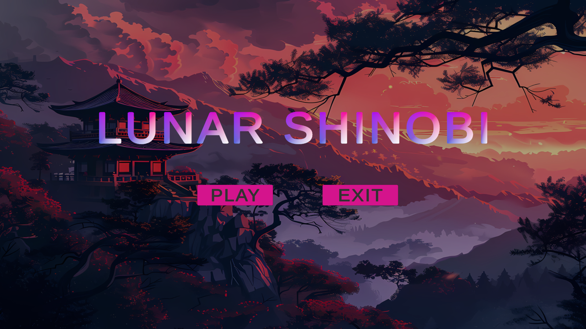
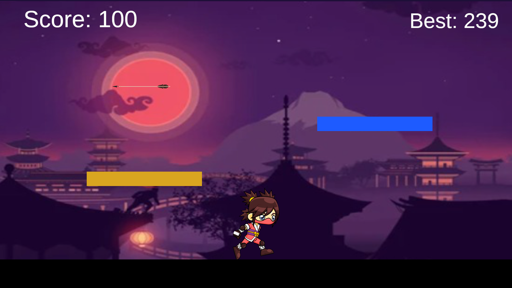
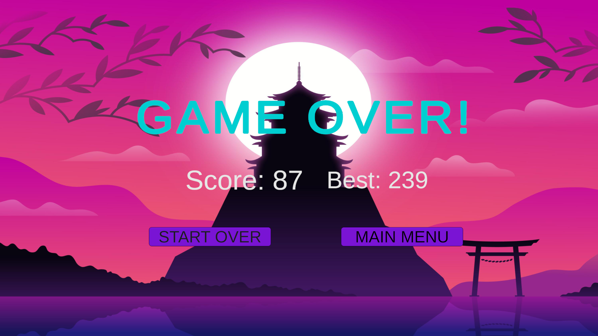

# Lunar-Shinobi
A fast-paced 2D endless runner built in Unity showcasing gameplay mechanics, UI systems, and game logic implementation.
Lunar Shinobi is a 2D endless runner game developed using Unity and C#.

## Features
- Infinite running gameplay
- Dynamic speed increase
- Score tracking system
- Game Over UI
- Restart and Menu system
- 
## 🎮 Play the Game
Download and play the latest build here:
👉 https://github.com/LANJANACHOWDARY/Lunar-Shinobi/releases

## Gameplay Screenshots
### Menu

### Gameplay

### Game Over

